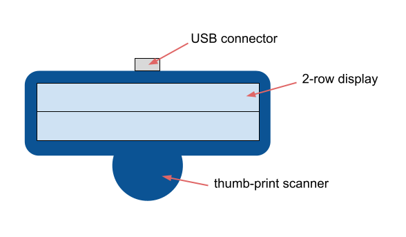

# online-voting
A description of a plan to implement secure, nation-wide voting for any candidate, referendum, or ballot initiative, including a citizen's state and local elections.

## Introduction
Online voting, if done securely, holds great potential to enable a greater and more highly participatory democracy. However, in the most powerful nation in the world, compromising it contains so much reward that nearly any effort, no matter how great, to rig or influence an election substatially would most certainly be worth the effort and cost. Because of this, measures must be taken so that citizens can be sure the count is accurate and fair, and even that votes are cast by real human beings, let alone eligible citizens.

To solve this issue, I propose a kind of USB device which a citizen can plug into their phone/tablet/PC when casting a vote.

Synopsis of usage:
1. A voter goes to a nearby registration location to pick up and register a device in their name. They download a voting app or program to their phone/tablet/PC.
2. To vote, the voter opens the app and scans their finger print to begin.
3. The voter chooses an election and an "option" (ex: candidate's name).
4. The device displays the election and option chosen, and the voter scans their finger print again to confirm the vote.
5. The vote is cast, and the device receives confirmation.
6. The device can be disconnected, or the voter can vote in another current election.

Overall Security Strategy:
1. Ensure end-to-end privacy and authentication between this device and any server.
2. Use unique keys for each device's communications, so that the exposure of one voter's key does not impact other voters.
3. Most keys are renewable, encrypted by hard-wired keys.
4. Hard-wired keys are used rarely, such as no more than yearly.
5. Each vote cast is encrypted with its own key to avoid vote-transmission from being blocked based on the content of the vote.
6. A vote-counting system should not be able to associate a vote with a voter's personal information or their voting device. This thwarts any attempts to disenfranchise voters based on demographic characteristics.
7. If post-election analysis is needed, privileged individuals can be given access to voter registrations, which can be associated with the votes cast.
8. Voter registrars are held accountable via "forced sharing" with other registrars, where privileged individuals verify the legitimacy of registrations from other registrars.
9. Vote-counting systems are held accountable by sending each vote to 2 random systems. One system will count "Round 1" while the other counts "Round 2." Totals for both rounds should match across all vote-counting systems involved in an election.

Security considerations have been divided into 4 areas:
1. Manufacturing of the devices.
2. Registration of each device with a voter.
3. Casting a vote via one of these devices.
4. Counting the votes from these devices.

In each of these areas, the plan uses information entropy so that any nefarious activity encounters maximum difficulty, receives minimal reward, and risks potential exposure. The plan also assumes a universal data contract used by servers so there are no incompatibilties with communication, authentication, or sharing of data. We can also assume that "hybrid" encryption (via encrypted AES key) is used when necessary, if not explicitly mentioned. In this document, this device will be referred to as "the USB device" or just "the device."

## I. Manufacturing
The devices should be manufactured in various securely controlled facilities across the nation. Once made, they are shipped to nearby Registration locations, where voters can go to receive a device. Voters do not need to return to the Registration location to cast a vote, only to receive a new device.

When manufactured, the facility will generate the following for each device:
1. **Device ID** - uniquely identifies the device, and includes a unique code corresponding to the facility
2. **Data encryption public/private key pair** - for privacy of data going to the device
3. **Data signature public/private key pair** - for authentication of data going to the device
4. **Registration encryption public/private key pair** - for privacy when registering the device with a voter
5. **Registration signature public/private key pair** - for authentication when registering the device with a voter

Each device will be hard-wired with the Device ID and either the private or public portion of the Data keys and Registration keys. For each public/private key pair, the remaining counter-part which does not go into the device will go into a database within the facility along with the Device ID for association. The database counter-parts are used for server-side communication between the device and servers. For brevity, we can refer to these keys as merely the "Data key" or "Registration key" and infer which ones are used based their given purpose and location (device or server). The aforementioned database will be called the "Manufacturer Database." A Manufacturer Database is only accessible to a "Registration Database" which authenticates by a client-side certificate and encryption key.

## II. Registration
Each Registration location will have its own Registration Database for the voters it registers. In order to securely and efficiently register devices, an additional type of device, which we'll call a "Registration Machine," has to be made and distributed to Registration locations, one machine for each line of people expected. Each machine will have its own client-side certificate and encryption key for communication with the Registration Database. Each machine will also have only enough memory for one voter to be registered, and an idle timer that clears the memory after a certain time limit.

### Security Goals
The registration process has these security goals in mind:
1. The device only allows a new registration if the request can be validated using a hard-wired key.
2. A registration's cryptographic details (keys, codes, etc...) can be renewed yearly without requiring any in-person visit.
3. No device, machine, or server can be used to derrive the unauthorized plain-text of any key, signature, hash, or salt/pepper code.
4. For technological simplicity, the device cannot use the following:
    - time-keeping for longer than 1 hour 
    - random number generation
5. The Registration Database should not return any keys from the Manufacturer Database.
6. The Registration Database should not be used to count votes toward a candidate.
7. The Vote-Counter Databases should not be able to derrive the Device ID or voter identity from a vote token.

### How to Register a Device
To register a device, it must be plugged into a Registration Machine. Then the following can happen:
1. A registration staff person populates the voter's personal information via PC connected to the machine, including a photo taken live.
2. The machine reads the Device ID from the device.
3. The machine sends the following in a request to the Registration Database to create a new "unconfirmed" registration for the device:
    - the Device ID
4. The Registration Database generates a new "registration" record with the following:
    - the Device ID
    - random Vote-Counting ID -- to identify the device to Vote-Counter Databases
    - random Pepper code -- for use with thumb-hash when voting
    - random Salt code -- to make thumb-hash unique for each vote
    - initial value of "Vote Code" -- a random value that changes after each vote
    - a new "Voter Key":
        - Device (to-server) key pairs for encryption/decryption and signature/authentication
        - Server (to-device) key pairs for encryption/decryption and signature/authentication
        - Vote-Counter key pairs for encryption/decryption and signature/authentication
5. The following "Registration" token is generated:
    - Voting URL
    - Device ID
    - Vote-Counting ID
    - Vote Code
    - Pepper code
    - Salt code
    - device-side Voter Key:
        - Device private keys *
        - Server public keys *
        - Vote-Counter public keys *
6. The URL of the Manufacturer Database is derrived from the Device ID and a known URL format.
7. The following are sent to the Manufacturer Database:
    - randomly generated AES key -- to be encrypted by the Data Key
    - hash of the token -- to form a signature with the Data key
8. The token, encrypted and signed using the Data Key, is then sent back to the Registration Machine, and the device-side keys (*) are discarded.
9. The Registration Machine sends the following to the device in a request to register a new voter:
    - the Registration token
10. The device validates the token and prompts the voter to scan their thumb print.
11. Once scanned, the thumb print is hashed into a "thumb-hash." The thumb-hash, Voter Key, and registration details are recorded in the device's persistent memory.
12. The device returns the following:
    - the thumb-hash, encrypted and signed by Registration Key
13. The Registration Machine then sends the following to the Registration Database to "confirm" the registration, encrypted and signed by the machine's key and certificate:
    - the Device ID
    - the voter data
    - HASH(pepper + thumb-hash), signed by device's Registration Key
14. The Registration Database decodes the fields and fills out the registration.
15. The Registration Database saves the peppered hash of the thumb-hash -- HASH(pepper + thumb-hash).
16. The Registration Database shares the following with Vote-Counter Databases to allow them to validate and decrypt votes from this device:
    - Vote-Counting ID
    - the Vote-Counter private keys *
    - the Device public keys
    - HASH(pepper + thumb-hash)
    - the Salt used to verify a thumb-print
17. The Vote-Counter private keys (*) are discarded.
18. The machine receives confirmation the registration was successful.

### How to Renew a Registration
Once registered to a person, a device's registration's cryptographic details (keys, codes, etc...) will need to be renewed at least yearly. The app will check if a renewal is needed whenever it is opened and verified.

1. The app connects to the Registration Database, requesting a new registration.
2. The Registration Database generates new keys and codes for a new "unconfirmed" registration.
3. The Registration Database obtains a new Registration token, signed and encrypted by the Data key from the Manufacturer Database.
4. The Registration token is returned to the app.
5. The app sends the token to the device.
6. The device decrypts and validates the token.
7. The device displays "Registration expired. Scan finger to continue."
8. The voter scans their thumb print to confirm.
9. The device validates the thumb print using persistent memory, to ensure it has not changed.
10. The device displays "Confirming new registration..."
11. The device then updates its cryptographic details in perisistent memory.
12. The device hashes the thumb-print with the new Pepper code -- HASH(pepper + thumb-hash)
13. The device returns the result, which is encrypted, signed, and sent to the Registration Database for confirmation.
14. The app receives a success message from the Registration Database that the registration is confirmed.
15. The app continues on to allow the voter to vote.

## III. Casting a Vote

### Security Goals
The voting process has these security goals in mind:
1. All goals pertaining to registration security apply.
2. The app should not be relied on to perform security mechanisms, such as random number generation, time-keeping, hashing, or encryption/decryption.
3. No malware or other apps should be capable of compromising the end-to-end security between the device and the intended servers.
4. It should be impossible to count a vote (towards a candidate/referrendum/etc.) without knowing a public key corresponding to the device's Voter Key.
5. Validation of each vote should require the voter's thumb print in a form that is unique from their other votes -- (ex: salted hash).

### First Time Opening the App
Before casting a vote, the voter must first download a certified app (or program) onto their phone/tablet/PC. Then they must open the app and connect their USB device. When opened for the first time, the app will read the Device ID from the device and, using a software-embedded certificate and decription key, download initial data from the Registration Database.

### The "Hash Negative"
One security mechanism involves a "hash negative" of a photo taken at registration. The app computes a hash of the executable code and uses the hash as a seed to generate pseudo-random data. This data is added to the "hash negative" to form the original photo. The "hash negative" has already been computed server-side by performing the same process, only subtracting the pseudo-random data, rather than adding. When the voter sees the photo, they know the hash matches. Furthermore, the app checks the resulting photo for corruption and calculates the Shannon Entropy and does not allow the voter to continue if the value is out of range.

### App Validation and Device Session
1. When you open the app, it requests "App Info."
2. The device returns the following from persistent memory:
    - Device ID
    - Voting URL -- to connect to the Registration Database
    - a unique App Salt code
3. Using the Voting URL, the app requests a Validation Signature from the Registration Database, sending the following:
    - Device ID
    - App Salt
    - App version details, such as iOS, Android, MacOS, PC, Linux, etc...
4. The Registration Database computes a salted hash of its own copy of the exact app version.
5. The Registration Database signs the hash with its Voter Key and returns the following:
    - the signature (without the hash code)
    - a "hash negative" of the registration photo, computed using the given App Salt
6. The app must compute a hash of itself and display the resulting photo.
7. The app sends the following in a request to the device to start a new "Device Session":
    - The hash computed by the app
    - The signature obtained from the Registration Database
8. The USB device validates the signature, and if valid, displays "If you see your photo, scan finger to continue. Otherwise, disconnect."
9. The device waits for a successful scan of the thumb print.
10. The device then hashes the App Salt for next time.
11. The device's voting operations are now unlocked for 1 hour.
12. The device returns a success message to the app, so it can continue.
13. The app then checks if the registration needs renewal, and if so, renews the registration.
14. If the device is in use for longer than 1 hour, or becomes disconnected, the Device Session becomes expired.
15. If the app attempts a voting operation after the Device Session is expired, the device returns a message that the device session is expired. The app must then request a new App Salt and Device Session.

### How to Cast a Vote
1. The voter opens the app and connects their USB device, going through the validation process.
2. Via the Voting URL, the app downloads a list of current elections from the Registration Database, along with the options (candidates/referrendums/etc.) for each election.
3. In the app, the voter navigates to the "Election" of choice to see the list of options.
4. The voter chooses an option.
5. The app reads the following from the device and requests a new Vote Session from the Registration Database:
    - Device ID
    - Vote Code from persistent memory
6. The Registration Database generates a device-related "Vote" token with the following:
    - a random Confirmation Number, unique to this vote
    - an AES key used to communicate with the device
    - a Time-Stamp (in seconds) indicating when the token was created
7. The following is sent back to the app:
    - the AES key, encrypted by the database's Voter Key
    - a new "Vote Session" token, encrypted by the AES key and signed by the database's Voter Key:
        - Vote Code
        - Confirmation Number
        - Session Time-Stamp
    - URL to a Vote-Casting server
8. The app sends the following to the device, requesting a "vote":
    - Election identifier
    - "Vote String" -- a human-readable string, such as a candidate's name, based on the option the voter chose
    - the AES key, as is
    - Vote Session token
9. The USB device validates the Vote Session token via its Voter Key. The token's Vote Code value must also match the device's internal Vote Code.
10. The device "increments" the Vote Code by computing a hash of the current value and overwriting it in persistent memory.
11. The device displays the Election identifiier and Vote String and waits for the voter to confirm.
12. The voter confirms by scanning their thumb print on the device.
13. The device displays a "busy" message -- "Sending vote..."
14. The device adds a record of the Confirmation Number and Election identifier in its persistent memory.
15. The device returns the following:
    - a "Vote Cast" token, signed by the device's Voter Key
        - Vote-Counting ID (from perisistent memory)
        - Confirmation Number
        - Session Time-Stamp
        - the same AES key used when decrypting, but encrypted by the device's Voter key
        - a "secure" field, encrypted by the same AES key:
            - the Election identifier
            - the Vote String
        - a salted hash of the thumb-hash -- HASH(salt + time-stamp + HASH(pepper + thumb-hash))
16. The app then sends the Vote Cast token, as is, in a request to the Vote-Casting server.
17. The app receives a message that the "Vote was cast" and displays it to the voter.
18. The app waits a short amount of time to receive a "Vote-Confirmation token," which can be sent to the USB device to prove the vote was counted:
    - Confirmation Number
    - signature of Confirmation Number, made with Vot-Counter private key
19. If the app request times out, a background process checks hourly to notfiy the voter that they voted. The notification will include the Vote-Confirmation token.
20. When the device receives a Vote-Confirmation token, it displays "You voted!" and the Election identifier corresponding to the Confirmation Number in its persisent memory. The record of the vote is then removed from memory.

## IV. Counting the Votes
Counting a vote involves 4 servers: 1 Vote-Casting Server, 2 Vote-Counter Databases, and 1 Final-Total server. The Vote-Casting Server receives votes and sends them to Vote-Counter Databases. Each Vote-Counter Database counts a portion of all votes in an election, and the Final-Total server sums the counts from all Vote-Counter Databases involved in the election. When a Vote-Counter Database receives a vote, that vote is tagged as either Round 1 or Round 2. All votes with Round 1 are prioritized over Round 2. However, all votes in both rounds eventually get counted. Round 2 exists solely to confirm results from Round 1.

### The Vote-Casting Server
The Vote-Casting Server ensures each vote is received in a timely manner and acts as a buffer during peak voting times. When it receives a Vote-Cast token, it then adds it's own "Received Time-Stamp" and sends the Vote-Cast token to 2 random Vote-Counter databases. One request adds a "Round" field with a value of 1, indicating it is for Round 1 count. The second request adds the Round field with a value of 2.

### How to Count a Vote
1. Upon each device's registration (or renewal of registration), a Vote-Counter Database receives the following:
    - Vote-Counting ID
    - Vote-Counter private keys
    - Device public keys
    - Peppered Hash -- HASH(pepper + thumb-hash)
    - Salt used to verify a thumb-print
2. When a Vote-Cast token is received, its Vote-Counting ID is used to look up the above information.
3. Once a Vote-Cast token is validated and decrypted, the result contains the following fields:
    - Received Time-Stamp
    - Vote-Counting ID
    - Confirmation Number
    - Session Time-Stamp
    - Election identifier
    - Vote String
    - Salted Hash -- HASH(device-salt + session-time-stamp + HASH(device-pepper + thumb-hash))
4. The Session Time-Stamp is checked for being within 30 seconds of the Received Time-Stamp. If it is not, it is invalid.
5. The Vote-Counter Database computes HASH(server-salt + session-time-stamp + peppered-hash) and compares it to the Salted Hash, which should match.
6. If there is a match, the vote is officially counted, placing the plain-text fields into a database table:
    - Vote-Counting ID
    - Confirmation Number
    - Received Time-Stamp
    - Session Time-Stamp
    - Counted Time-Stamp -- created new
    - Election Identifier
    - Vote String
    - Vote-Cast token, as received
  
### Counting Votes
Counting votes consists of simply totalling the row-counts by Election Identifier and Vote String. This can be polled regularly to see how the election is progressing.

### Final-Total Server
The Final-Total server totals votes from all Vote-Counter Databases for a region's current elections. This can be done regularly during an election to see how it is progressing. Totals for Round 1 and Round 2 can be placed side-by-side, but only Round 1 will be the most transparent until all votes are counted.
